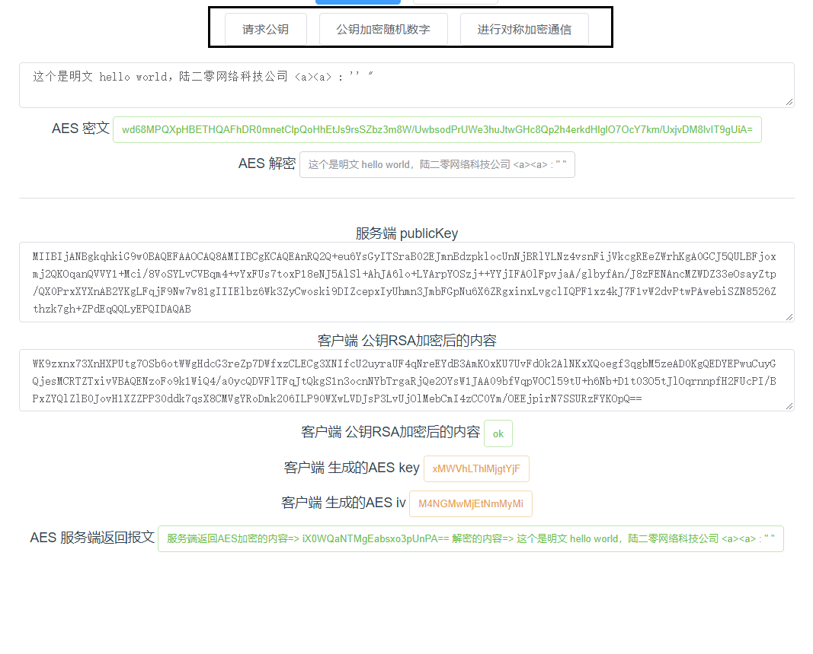

# websecurity
基于HTTPS的加密方式微服务接口的加密工具

关于HTTPS的加密的方式，您可以参考 https://blog.csdn.net/Hello_Ray/article/details/104326582

微服务报文加密工具，AES与RSA加密的方式的结合，有效防止微服务在流量过滤器里被抓包的风险，提高API接口的安全性！

**对称加密： AES**

**非对称加密： RSA**

#### client文件 
通过vue前端项目模拟的客户端

#### server文件夹 
通过java springboot项目模拟的服务端

#### 代码启动运行

如上图中画框的三个按钮

+ 请求公钥按钮：HTTPS建立链接前的请求公钥

+ 公钥加密随机数字：服务端收到响应给客户端，客户端随机生成一个对称加密密钥；使用公钥加密后发送给服务端

+ 对称加密密钥协商完成后，后续的通信采用了对称加密

